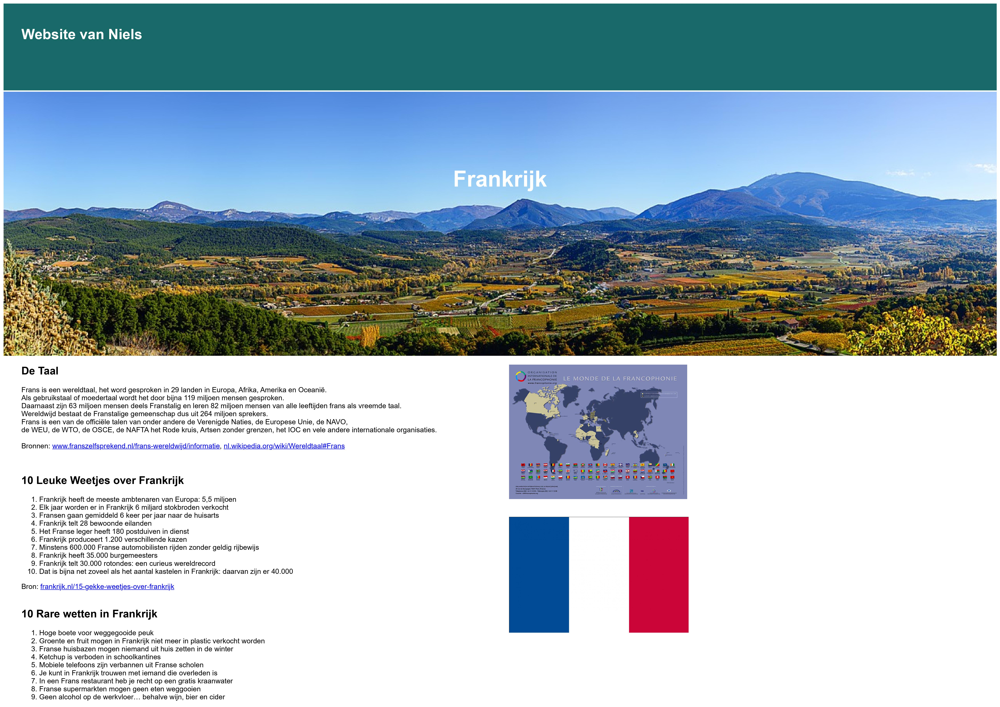
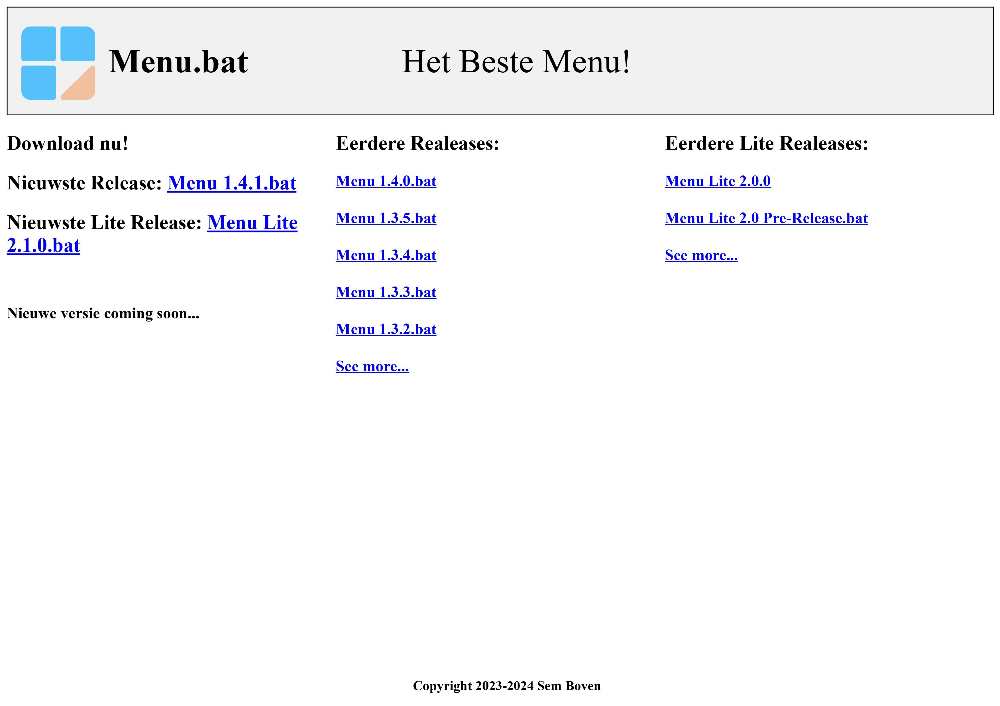

<h1>👋 Hi, I’m <a href="https://github.com/niels-joel" alt="My Profile">@niels-joel</h1></a>

  
<h3>- I'm currently learning HTML and CSS (and a little bit of Php)</h3>

<h3>- Here are some of my Websites 👇</h3>

<a href="https://niels-joel.github.io/frankrijk/" alt="Frankrijk Website">Frankrijk</a>

<a href="https://niels-joel.github.io/menu/" alt="Menu Website">Menu</a>

              
<h3>- My Statistics👇</h3>

 
  

